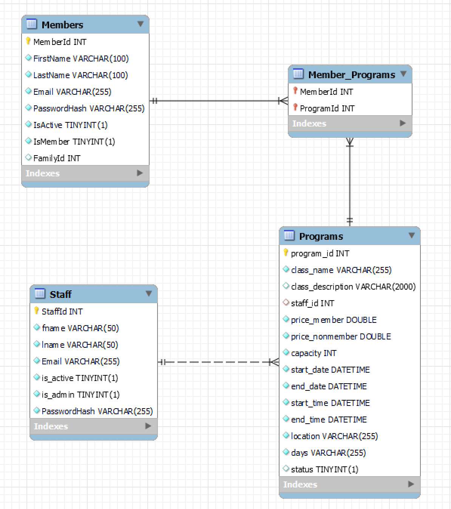

# YMCAProject

## Launch Information
To run the project, in your terminal navigate to the project directory then type: ```dotnet run```

## Login Info
Staff
|User|Password|
|---|---|
|admin@ymca.com|admin|

Members/NonMembers
|User|Password|
|---|---|
|example@email.com|123|
|jane@demo2.com|demo2|
|luke@demo2.com|demo2|
|aini@demo2.com|demo2|

## Additional Assumptions
- The software does not verify whether a user has completed program pre-requisites; it is up to the user to register for the correct class.
- Program pre-requisites are provided in the description
- Participants are responsible for checking their dashboard to verify their class schedule
- Site does not handle fee payment
- Site does not hard delete user accounts
- Only staff can create or delete programs.
- All staff have corresponding personal member accounts to register for classes.  

## ER Diagram

